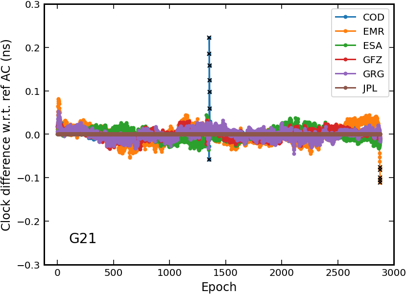

# clkcomb

`clkcomb` is a program developed for the combination of multi-GNSS clock and
phase bias products. It is built on an earlier version of the
[PPPx](https://github.com/YuanxinPan/PPPx_bin) software package.

The initial development was completed as part of my MSc thesis in 2021. Since then,
the software has been further developed and applied to the IGS repro3 project at
Wuhan University. For a detailed explanation of the theories behind clock and
phase bias combination, please refer to my [MSc thesis](doc/Pan_MSc_Thesis_2021.pdf).

The following publications are based on this software (or an updated version of it):
- Geng J., Yan Z., Wen Q., Männel B., Masoumi S., Loyer S., Mayer-Gürr T., & Schaer S. (2024)
  Integrated satellite clock and code/phase bias combination in the third IGS
  reprocessing campaign. GPS Solut 28(3), 1-19.
  https://doi.org/10.1007/s10291-024-01693-9
- Geng J., Wen Q., Chen G., Dumitraschkewitz P., & Zhang Q. (2024)
  All-frequency IGS phase clock/bias product combination to improve PPP
  ambiguity resolution. J Geod 98(6), 48.
  https://doi.org/10.1007/s00190-024-01865-y
- Yuanxin Pan. (2021) BDS/GNSS clock and phase bias products combination for precise
  point positioning with ambiguity resolution. [Master thesis, Wuhan University].
  China National Knowledge Infrastructure. https://doi.org/10.27379/d.cnki.gwhdu.2021.000240


## Installation

### Linux & MacOS

Ensure you have the GNU make and a valid c++ compiler installed on your computer.
To install `clkcomb`, please clone the repository and compile the source code:

```
git clone git@github.com:YuanxinPan/clkcomb.git
cd clkcomb && make
```

The executables will be generated in the `bin/` directory.

### Windows

Open `src/vc++/clkcomb.sln` with Visual Studio (version 2013 or later).
Please note that the program has not yet been tested on Windows.


## Usage

1. Download IGS products for each analysis center:
    - sp3: precise satellite orbits
    - clk: precise satellite clocks
    - [bia]: satllite phase biases
    - [obx]: satellite attitudes

> The sp3 of the second day will be needed if the 24:00 epoch is not included in the sp3 of current day

2. Modify the configuration file [comb.ini](comb.ini)
    - session time
    - GNSS constellations
    - path to AC products
    - ...

3. Execute the program

```shell
./bin/clkcomb comb.ini
```

4. Visualization

```shell
bash scripts/plot_clkdif.sh dif_file log_file
```


## Running the test

To help you get started, an example is provided in the folder `example`.
Run the following commands to conduct a combination test of GPS clock products:

```shell
cd example/clkcomb/
./run.sh    # combination & plotting
```

For example, here is the comparison of G21 satellite clocks among different
analysis centers (2022-001):




## Contributing

Please contribute via the **Pull requests** system.


## Author

- **Yuanxin Pan** - [YuanxinPan](https://github.com/YuanxinPan)


## License

This project is licensed under the BSD-3-Clause License - see the
[LICENSE](LICENSE) file for details.

